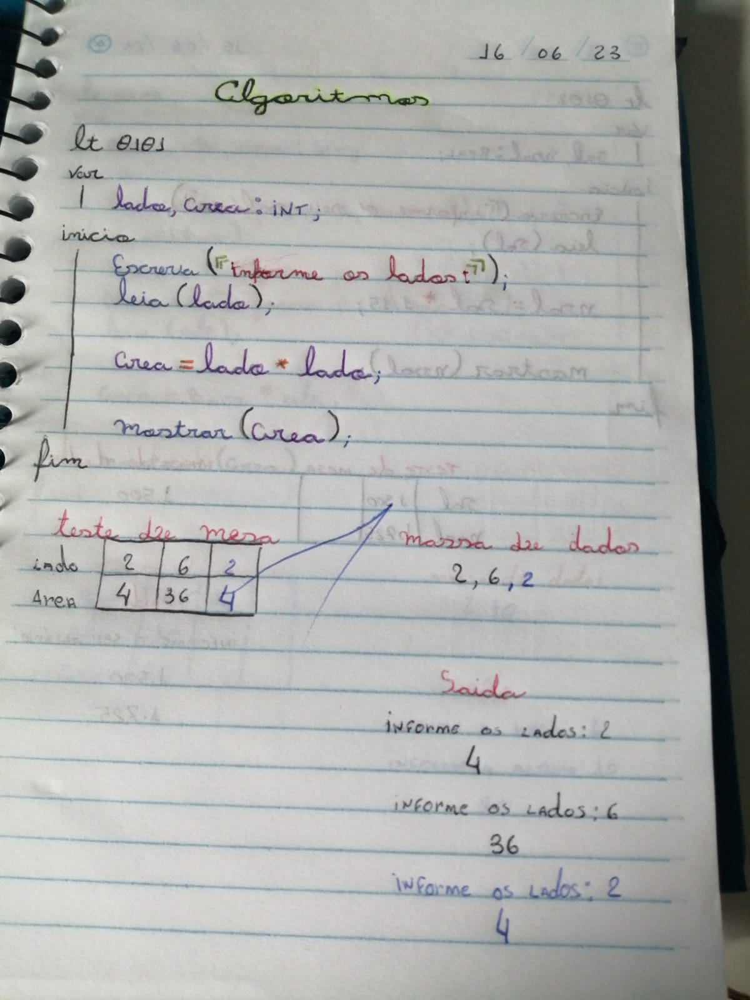

## Absorvendo conhecimentos

 Este exercicio foi proposto pelo professor Ricardo Satoshi inicialmente em Portugol, Depois colocado em Java, e por fim em Python

Linguagem utilizada: 

IDE

Lógica Inicial:

